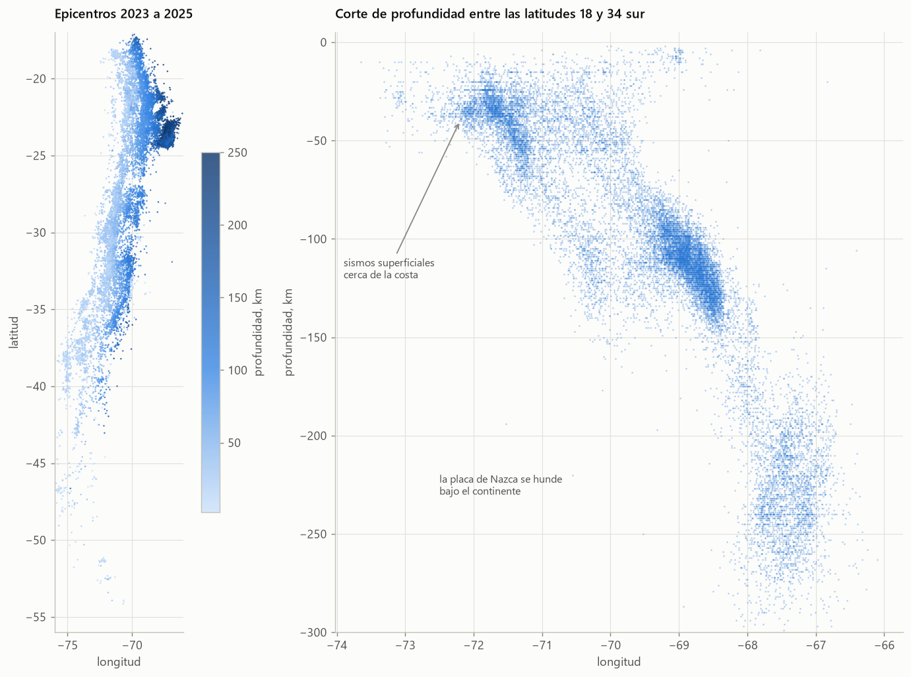

# Análisis de datos

## 01. Segmentación de los bancos chilenos

[Abrir el notebook](01_segmentacion_bancos.ipynb)

**Pregunta.** ¿Qué grupos de bancos existen en Chile según su solvencia, rentabilidad, riesgo de crédito, eficiencia y modelo de negocio?

**Datos.** Indicadores mensuales por banco de la API BEST de la Comisión para el Mercado Financiero (CMF): solvencia de Basilea III, rentabilidad sobre patrimonio, cartera deteriorada, morosidad, provisiones, gastos operacionales y composición de la cartera de crédito. El corte transversal usa el promedio entre agosto de 2025 y julio de 2026, y la evolución histórica parte en 2019.

**Método.**

- Una variable por dimensión económica, con logaritmos para las variables muy asimétricas.
- Clustering k-means y jerárquico de Ward, con el número de grupos elegido por el coeficiente de silueta.
- Análisis de componentes principales para ubicar a los bancos en un mapa y entender qué separa a los grupos.
- Comparación entre métodos con el índice de Rand ajustado.

**Conclusiones.**

- El sistema tiene tres grupos: banca universal, banca de consumo y banca mayorista extranjera.
- La banca universal concentra casi todo el crédito del sistema.
- Todos los bancos superan con holgura el mínimo legal de capital de 8% de los activos ponderados por riesgo.
- Falabella es un banco híbrido: según el método queda en la banca de consumo o en la universal.

## 02. Sismicidad en Chile

[Abrir el notebook](02_sismicidad_chile.ipynb)

**Pregunta.** ¿Qué patrones tiene la actividad sísmica de Chile, y qué tan completo y confiable es el catálogo nacional?

**Datos.** 22.335 sismos entre 2023 y 2025, extraídos con web scraping desde el catálogo diario del Centro Sismológico Nacional (CSN), y el catálogo del Servicio Geológico de Estados Unidos (USGS) consultado por su API.

**Método.**

- Extracción de una página HTML por día, con pausas entre solicitudes y caché local.
- Limpieza y controles de calidad: duplicados, datos faltantes, zona horaria y ubicación.
- Emparejamiento de sismos entre ambos catálogos por tiempo y distancia.
- Ley de Gutenberg-Richter con el estimador de máxima verosimilitud de Aki y Utsu, y análisis de estabilidad del valor b.

**Conclusiones.**

- El CSN registra trece veces más sismos que el USGS dentro de Chile y encuentra el 98% de los que el USGS ubica en el país.
- La profundidad de los sismos dibuja la placa de Nazca hundiéndose bajo el continente.
- Sobre magnitud 4 se cumple Gutenberg-Richter con un valor b de 1,02. Bajo ese umbral, el cambio de escala de magnitud del catálogo sesga la estimación.

## Datos de la CMF

Los cuadros descargados quedan en caché en la carpeta de datos, así que el notebook se ejecuta sin conexión y sin clave. Para actualizar los datos se necesita una clave gratuita de la API BEST, que se solicita en best.cmfchile.cl. La clave se guarda en un archivo `.env` en la raíz del repositorio, con la línea `CMF_API_KEY=tu_clave`. Ese archivo está excluido de git.

La API permite 10 consultas por minuto y 100 por día. El cliente del paquete respeta ese ritmo y nunca muestra la clave en sus mensajes.
