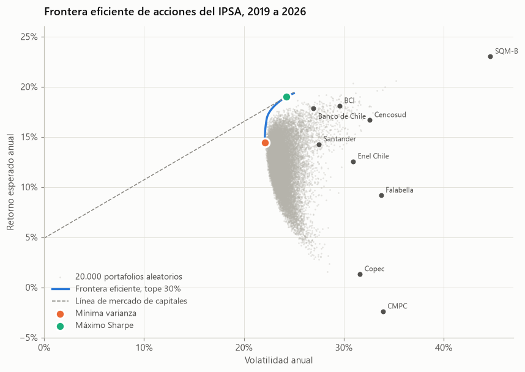
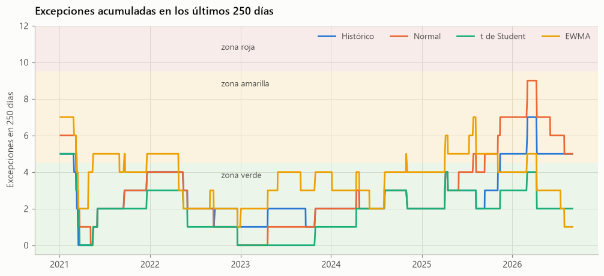
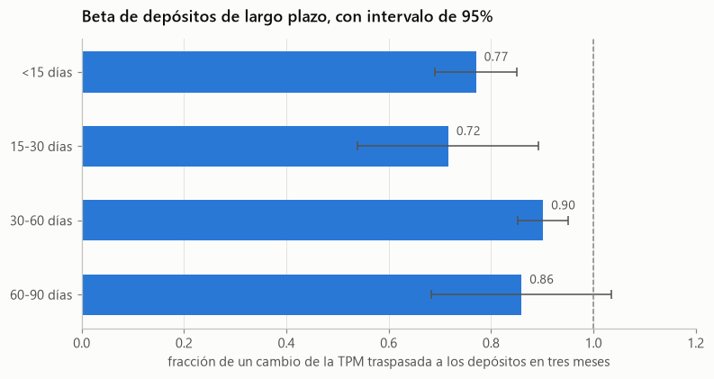

# Finanzas

Cuatro análisis. Los dos primeros usan acciones chilenas del IPSA entre enero de 2019 y agosto de 2026: uno construye portafolios y el otro mide su riesgo de cola. El tercero estudia el traspaso de la TPM a las tasas de depósitos de los bancos, y el cuarto la curva de tasas en pesos y su riesgo.

## 01. Optimización de portafolio

[Abrir el notebook](01_optimizacion_portafolio.ipynb)

**Pregunta.** ¿Se puede construir un portafolio de acciones chilenas con mejor relación retorno-riesgo que el IPSA, y esa ventaja se mantiene fuera de muestra?

**Método.**

- Estadísticas de retorno, volatilidad y correlación de nueve acciones del IPSA.
- Regresión CAPM contra el ETF It Now IPSA, con la TPM como tasa libre de riesgo.
- Frontera eficiente sin ventas cortas y con un máximo de 30% por acción.
- Backtest con rebalanceo trimestral, ventana de estimación de dos años y costo de 20 puntos base por unidad transada.

**Conclusiones.**

- Las tres estrategias diversificadas superaron al ETF IPSA en el período fuera de muestra.
- La frontera dentro de muestra exagera los beneficios, porque se calcula conociendo qué acciones subieron.
- Los intervalos de confianza del índice de Sharpe se superponen. Cinco años no bastan para distinguir habilidad de suerte.
- Mínima varianza es la alternativa más defendible, porque no depende de estimar retornos esperados.

## 02. Riesgo de mercado: VaR, ES y backtesting

[Abrir el notebook](02_metricas_de_riesgo.ipynb)

**Pregunta.** ¿Qué método de VaR habría medido correctamente el riesgo diario de una cartera de acciones chilenas entre 2020 y 2026?

**Método.**

- VaR al 99% por simulación histórica, normal, t de Student y EWMA de RiskMetrics.
- Pronósticos diarios con ventana móvil, usando solo información anterior a cada día.
- Pruebas de Kupiec para la frecuencia de excepciones y de Christoffersen para su agrupamiento.
- Semáforo de Basilea sobre ventanas de 250 días y revisión de la severidad frente al ES.

**Conclusiones.**

- Los retornos tienen colas mucho más pesadas que una normal.
- La t de Student es el único método que pasa ambas pruebas, a cambio de un VaR promedio mayor.
- El histórico y el normal aciertan en la frecuencia de excepciones, pero estas llegan agrupadas.
- En los días de excepción, la pérdida real supera al ES pronosticado en los cuatro métodos.

## 03. Tasas de captación y beta de depósitos

[Abrir el notebook](03_tasas_de_captacion.ipynb)

**Pregunta.** ¿Cuánto y qué tan rápido traspasan los bancos los cambios de la TPM a sus depósitos, y qué bancos se financian más barato?

**Método.**

- Tasas de depósitos por plazo de la API BEST de la CMF desde 2014, solo en los tramos menores a 90 días, que son nominales en pesos. Los tramos más largos mezclan depósitos en pesos y en UF.
- Beta de depósitos con un modelo de rezagos distribuidos, betas por ciclo de la TPM y prueba de asimetría entre alzas y bajas.
- Prueba de la hipótesis de expectativas con la pendiente del tramo corto.
- Costo de fondeo de cada banco frente a la TPM, cruzado con los grupos del proyecto de segmentación.

**Conclusiones.**

- La beta de depósitos va de 0,72 a 0,90 según el plazo, y es igual en alzas y en bajas.
- En el ciclo de alzas de 2022 y 2023, los depósitos más cortos pagaron más de 2 puntos bajo la TPM.
- La pendiente del tramo corto casi no anticipa la TPM, porque refleja un premio por plazo.
- El tamaño explica el costo de fondeo mejor que el modelo de negocio.

## 04. Curva de tasas y escenarios de IRRBB

[Abrir el notebook](04_curva_de_tasas.ipynb)

**Pregunta.** ¿Cómo se mueve la curva de tasas en pesos y cuánto valor pierde una cartera de bonos ante los escenarios de shock de Basilea para IRRBB?

**Método.**

- Curva swap promedio cámara en pesos del Banco Central, de 3 meses a 10 años, diaria desde 2008.
- Ajuste diario de Nelson-Siegel con el parámetro de forma fijo de Diebold y Li.
- Componentes principales de los cambios mensuales de la curva.
- Duración, convexidad y los seis escenarios de Basilea, calibrados con el método del estándar sobre la tasa promedio chilena.

**Conclusiones.**

- Nelson-Siegel ajusta la curva con un error mediano de 4 puntos base, y nivel y pendiente explican el 97% de sus movimientos.
- La curva estuvo invertida el 18% de los días desde 2008, con un máximo de 6,2 puntos en enero de 2023.
- Una cartera con duración de 4,7 años pierde 10,8% ante el alza paralela calibrada, de 250 puntos base.
- Los cambios históricos del tramo corto casi duplican el shock corto calibrado, así que conviene complementar con estrés histórico.

## Supuestos de los notebooks 01 y 02

- **Universo.** BCI, Santander, Banco de Chile, Cencosud, CMPC, Copec, Enel Chile, Falabella y SQM-B. Se excluye LATAM por su quiebra y reestructuración entre 2020 y 2022.
- **Sesgo de supervivencia.** Las acciones se eligieron con información de hoy, lo que favorece a las estrategias frente al índice.
- **Datos.** Los precios quedan en caché en la carpeta de datos, así que los resultados son reproducibles.
