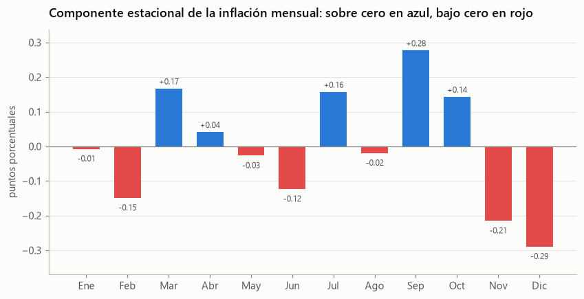
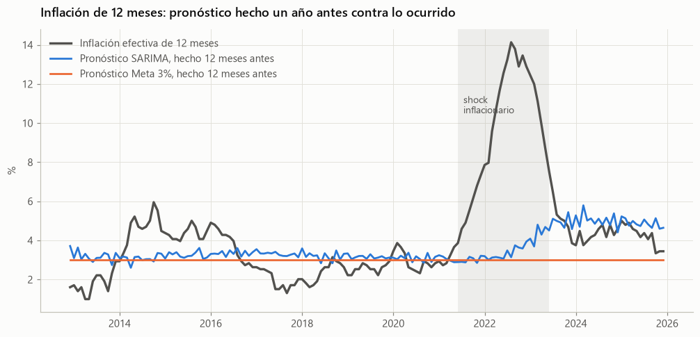
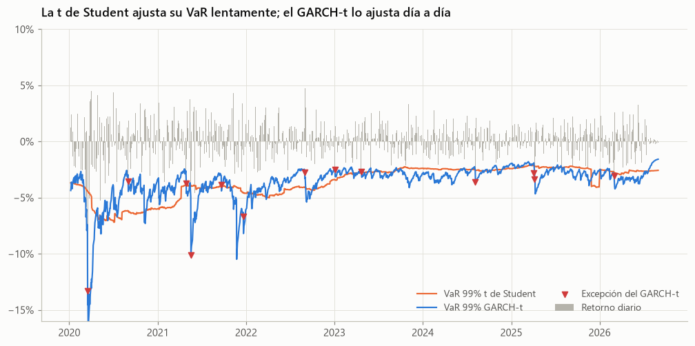

# Series de tiempo

Cuatro análisis sobre series macroeconómicas y financieras de Chile. Van de lo descriptivo a lo predictivo y terminan conectando con la medición de riesgo del bloque de finanzas.

| Notebook | Tipo | Pregunta |
|---|---|---|
| [01. Descripción y descomposición](01_descripcion_y_descomposicion.ipynb) | Descriptivo | ¿Qué patrones tienen las series y cómo deben transformarse? |
| [02. Modelos univariados](02_modelos_univariados.ipynb) | Univariado | ¿Puede un modelo pronosticar la inflación mejor que la meta del 3%? |
| [03. Modelos multivariados](03_modelos_multivariados.ipynb) | Multivariado | ¿Cómo interactúan inflación, actividad, TPM y dólar? ¿Mejora el pronóstico? |
| [04. Volatilidad con GARCH](04_volatilidad_garch.ipynb) | Univariado de volatilidad | ¿Mide mejor el riesgo un GARCH con colas pesadas? |

## Datos

Series del Banco Central de Chile obtenidas desde mindicador.cl, sin necesidad de registro: IPC desde 1995, IMACEC desde 1997, TPM desde 2001 y dólar observado desde 2000. La fuente publica el IPC hasta diciembre de 2025. Todas quedan en caché en la carpeta de datos del repositorio.

## 01. Descripción y descomposición

- La inflación mensual tiene estacionalidad moderada, con alzas en marzo, julio, septiembre y octubre, y bajas en noviembre y diciembre.
- Los niveles del IPC y del dólar tienen raíz unitaria según las pruebas ADF y KPSS. Sus variaciones son estacionarias.
- Desde 2002, la inflación estuvo dentro del rango de 2% a 4% en cerca de la mitad de los meses.

## 02. Modelos univariados

Se comparan SARIMA, ETS y tres reglas simples con evaluación de origen móvil entre 2012 y 2025.

- El SARIMA tiene el menor error para la inflación de doce meses, pero la prueba de Diebold-Mariano no distingue su precisión de la de los demás.
- Hasta 2019, suponer que se cumplía la meta del 3% fue el pronóstico más preciso. Es una muestra de la credibilidad del Banco Central.
- Ningún modelo univariado anticipó el shock inflacionario de 2021 y 2022.

## 03. Modelos multivariados

VAR con IMACEC, inflación, TPM y dólar entre 2002 y 2025.

- La TPM responde a la inflación, la actividad y el dólar, como corresponde a la función de reacción del Banco Central.
- Las respuestas al impulso muestran el conocido "price puzzle": tras un alza de la TPM, la inflación sube en los primeros meses.
- El VAR de 13 rezagos, que mejor describe el pasado, es el peor pronosticador. Ninguna versión del VAR supera significativamente a los modelos univariados.

## 04. Volatilidad con GARCH

GARCH y GJR-GARCH con innovaciones t de Student para el dólar y la cartera IPSA del bloque de finanzas.

- La volatilidad del dólar es muy persistente y sube más cuando el peso se deprecia.
- El GARCH con t de Student pasa las pruebas de Kupiec y Christoffersen en ambos activos.
- Su Expected Shortfall anticipa la severidad de las pérdidas mucho mejor que los métodos del bloque de finanzas.

## Reproducibilidad

El notebook 02 guarda sus errores de pronóstico en la carpeta de resultados, y el notebook 03 los usa para comparar sobre los mismos orígenes. Por eso conviene ejecutarlos en orden.
