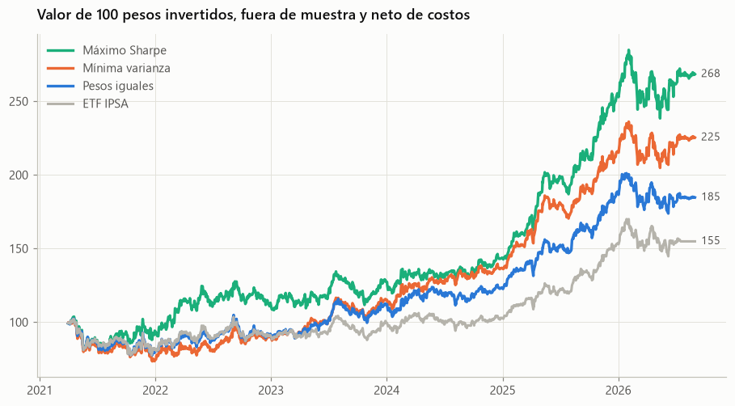
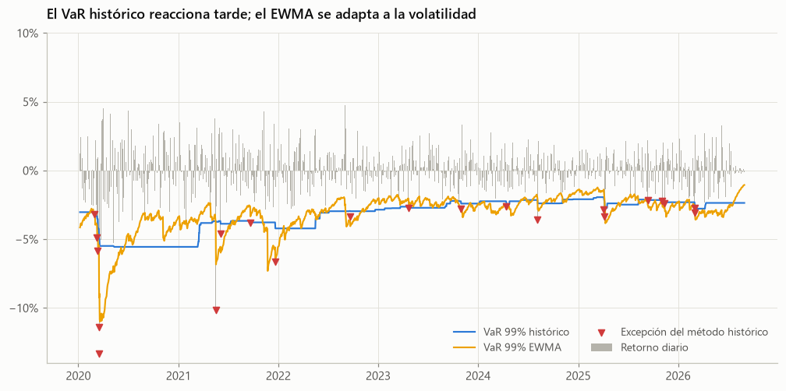
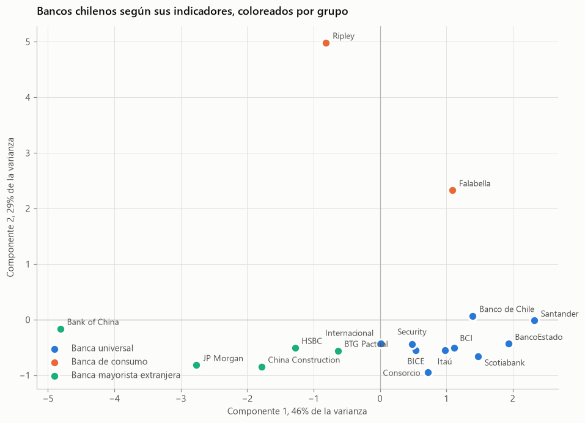
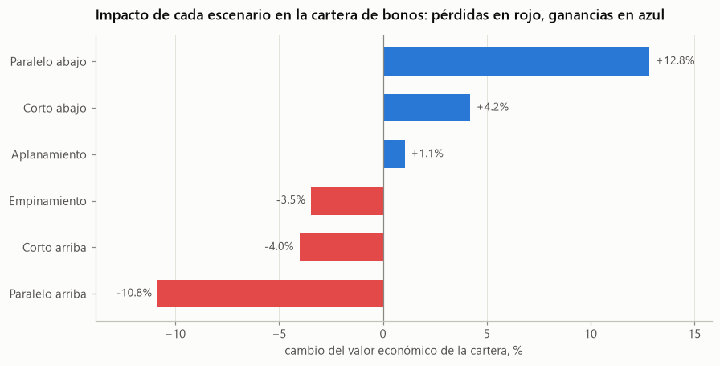
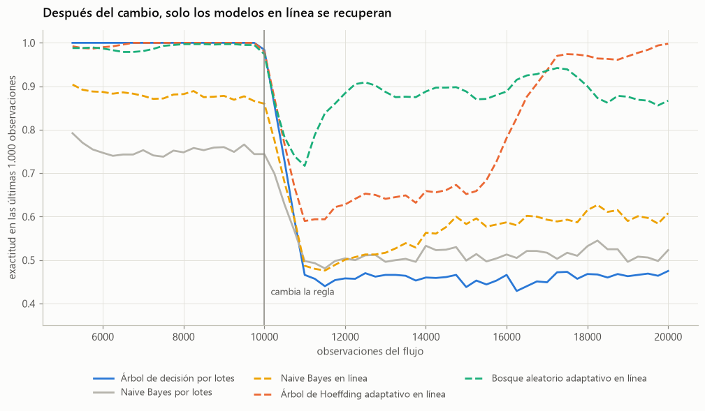
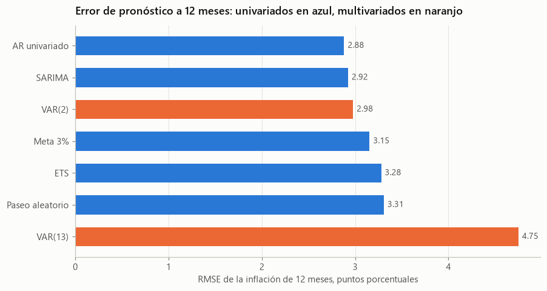

# Data Science Aplicado: finanzas cuantitativas y riesgo

Proyectos de análisis de datos, finanzas y series de tiempo con datos públicos de Chile, desarrollados por **Yerko Carreño**, analista de riesgo financiero.

Cada proyecto responde una pregunta concreta, usa datos reproducibles y termina con conclusiones y limitaciones explícitas. Las funciones comunes viven en un paquete de Python con pruebas automáticas.

## Proyectos

| Área | Proyecto | Estado | Qué muestra |
|---|---|---|---|
| Finanzas | [Optimización de portafolio con acciones del IPSA](02_finanzas/01_optimizacion_portafolio.ipynb) | Listo | Markowitz, CAPM y backtest fuera de muestra con costos |
| Finanzas | [Riesgo de mercado: VaR, ES y backtesting](02_finanzas/02_metricas_de_riesgo.ipynb) | Listo | Cuatro métodos de VaR, Kupiec, Christoffersen y semáforo de Basilea |
| Finanzas | [Tasas de captación y beta de depósitos](02_finanzas/03_tasas_de_captacion.ipynb) | Listo | Traspaso de la TPM a los depósitos y costo de fondeo por banco, con datos de la CMF |
| Finanzas | [Curva de tasas y escenarios de IRRBB](02_finanzas/04_curva_de_tasas.ipynb) | Listo | Nelson-Siegel, componentes principales, duración, convexidad y los seis escenarios de Basilea, con datos del Banco Central |
| Series de tiempo | [Descripción y descomposición](03_series_de_tiempo/01_descripcion_y_descomposicion.ipynb) | Listo | Estacionalidad del IPC, raíz unitaria y autocorrelación |
| Series de tiempo | [Modelos univariados](03_series_de_tiempo/02_modelos_univariados.ipynb) | Listo | SARIMA y ETS contra la meta del 3%, con origen móvil |
| Series de tiempo | [Modelos multivariados](03_series_de_tiempo/03_modelos_multivariados.ipynb) | Listo | VAR, causalidad de Granger, impulso-respuesta y pronóstico |
| Series de tiempo | [Volatilidad con GARCH](03_series_de_tiempo/04_volatilidad_garch.ipynb) | Listo | GARCH y GJR con colas t, y VaR condicional |
| Análisis de datos | [Sismicidad en Chile](01_analisis_de_datos/02_sismicidad_chile.ipynb) | Listo | Web scraping del CSN, validación con la API del USGS y ley de Gutenberg-Richter |
| Aprendizaje en línea | [Datos de ALeRCE](04_aprendizaje_en_linea/01_datos_alerce.ipynb) | Listo | 123.496 objetos astronómicos, jerarquía de clases y valores faltantes |
| Aprendizaje en línea | [Por lotes frente a en línea](04_aprendizaje_en_linea/02_lotes_vs_en_linea.ipynb) | Listo | Mi tesis actualizada: nueve modelos, clases raras y cambio de concepto |
| Aprendizaje en línea | [Complejidad computacional](04_aprendizaje_en_linea/03_complejidad_computacional.ipynb) | Listo | Tiempo de entrenamiento y costo de mantener un modelo al día |
| Análisis de datos | [Segmentación de bancos chilenos](01_analisis_de_datos/01_segmentacion_bancos.ipynb) | Listo | Clustering con datos de la API de la CMF, k-means, Ward y PCA |

## Resultados destacados

**Optimización de portafolio.** Las tres estrategias diversificadas superaron al ETF IPSA entre 2021 y 2026, ya descontados los costos. Sin embargo, con cinco años de datos la ventaja del portafolio de máximo Sharpe no es estadísticamente significativa.



**Riesgo de mercado.** Los retornos de acciones chilenas tienen colas mucho más pesadas que una normal. El VaR con t de Student es el único de los cuatro métodos que pasa las pruebas de Kupiec y Christoffersen.



**Segmentación de bancos.** Con datos de la API de la CMF, los 17 bancos chilenos se agrupan en banca universal, banca de consumo y banca mayorista extranjera. La banca universal concentra casi todo el crédito, y todos los bancos superan con holgura el mínimo de capital de Basilea III.



**Tasas de captación.** Los bancos traspasan entre 72% y 90% de los cambios de la TPM a sus depósitos en unos tres meses, sin diferencias entre alzas y bajas. Es la beta de depósitos, un supuesto clave en los modelos de IRRBB. Los bancos grandes se financian bajo la TPM y los pequeños sobre ella.

**Curva de tasas.** La curva swap en pesos se describe con tres factores de Nelson-Siegel, y nivel y pendiente explican el 97% de sus movimientos. En los escenarios de Basilea calibrados para el peso chileno, una cartera de bonos con duración de 4,7 años pierde 10,8% ante un alza paralela. Los movimientos históricos del tramo corto superan los shocks estándar.



**Aprendizaje en línea.** Mi tesis, reconstruida con datos públicos de ALeRCE y la librería river. Con datos estables gana el aprendizaje por lotes, pero cuando la regla del problema cambia, solo los modelos en línea se recuperan.



**Series de tiempo.** Un SARIMA simple pronostica la inflación tan bien como un VAR con cuatro variables, y antes de 2020 la meta del 3% fue el mejor pronóstico. En riesgo, un GARCH con colas t pasa todas las pruebas de backtesting y corrige la subestimación del Expected Shortfall.



## Estructura

```
├── 01_analisis_de_datos/ segmentación de bancos y sismicidad en Chile
├── 02_finanzas/          notebooks de finanzas y sus figuras
├── 03_series_de_tiempo/  notebooks de series de tiempo, figuras y resultados
├── src/dsaplicado/       paquete compartido
│   ├── datos.py          descarga y caché de Yahoo Finance y mindicador.cl
│   ├── cmf.py            cliente de la API BEST de la CMF, con control de ritmo y caché
│   ├── bcch.py           cliente de la API de la Base de Datos Estadísticos del Banco Central
│   ├── portafolio.py     optimización, CAPM y backtest con rebalanceo
│   ├── riesgo.py         VaR, ES, EWMA, GARCH y pruebas de backtesting
│   ├── series.py         estacionariedad, origen móvil y prueba de Diebold-Mariano
│   ├── tasas.py          beta de depósitos, Nelson-Siegel, duración y escenarios de Basilea
│   ├── sismos.py         scraping del catálogo del CSN, API del USGS y Gutenberg-Richter
│   ├── en_linea.py       evaluación prequential, datos de ALeRCE y complejidad computacional
│   └── graficos.py       estilo gráfico común y paleta apta para daltonismo
├── tests/                pruebas unitarias del paquete
├── datos/                datos públicos en caché para reproducir los resultados
├── 04_aprendizaje_en_linea/ tesis actualizada, con la versión original en legacy
└── archivo/              trabajos anteriores que no se mantienen
```


## Cómo reproducir

Requiere Python 3.10 o superior.

```bash
python -m venv .venv
source .venv/bin/activate        # en Windows: .venv\Scripts\activate
pip install -r requirements.txt
pytest                           # pruebas del paquete
jupyter lab                      # abrir los notebooks
```

Los notebooks leen los datos desde `datos/`, así que entregan los mismos resultados sin conexión. Para actualizarlos, cada función de carga acepta `actualizar=True`. Actualizar los datos de la CMF y del Banco Central requiere claves gratuitas de sus APIs, guardadas en un archivo `.env` que git ignora, con las líneas `CMF_API_KEY=...` y `BCCH_TOKEN=...`.

## Fuentes de datos

- **Yahoo Finance.** Precios diarios ajustados por dividendos de acciones del IPSA y del ETF It Now IPSA.
- **mindicador.cl.** IPC, IMACEC, Tasa de Política Monetaria y dólar observado, publicados por el Banco Central de Chile.
- **Centro Sismológico Nacional y USGS.** Catálogo de sismos de sismologia.cl, extraído con web scraping, y catálogo mundial del Servicio Geológico de Estados Unidos.
- **API del Banco Central de Chile.** Tasas swap promedio cámara en pesos y tasas de mercado secundario de bonos del Banco Central.
- **API BEST de la CMF.** Indicadores de solvencia, rentabilidad, riesgo de crédito y actividad por banco, y tasas de depósitos por plazo, publicados por la Comisión para el Mercado Financiero.
- **ALeRCE y UCI.** Conjunto etiquetado del clasificador de curvas de luz de ALeRCE, publicado en Zenodo con licencia CC BY 4.0, y candidatos a púlsar HTRU2 del repositorio de la UCI.

## Trabajos anteriores

La carpeta [archivo](archivo/) conserva un ejercicio de scraping de 2022 y un análisis de accidentes laborales de 2020. La versión original de la tesis está en la carpeta legacy del proyecto de aprendizaje en línea. Todos se mantienen como registro y no se actualizan.

## Sobre mí

Analista de riesgo financiero, ingeniero en estadística y magíster en Business Analytics. Candidato al FRM Part I en noviembre de 2026.

Mi foco profesional es riesgo de mercado, ALM e IRRBB, riesgo de liquidez, VaR y Expected Shortfall, pruebas de estrés, validación de modelos y regulación bancaria de Basilea III.

**Herramientas:** Python, R, SQL, estadística, series de tiempo, machine learning, Power BI y Tableau.

Estoy desarrollando proyectos de riesgo más extensos en repositorios independientes:

1. Validación de modelos de VaR y Expected Shortfall
2. Motor de riesgo IRRBB y ALM
3. Riesgo de contraparte y colaterales
4. Riesgo de crédito bajo IFRS 9
5. Laboratorio integrado de riesgo bancario

## Licencia

Código bajo licencia MIT. Los datos pertenecen a sus respectivas fuentes.
